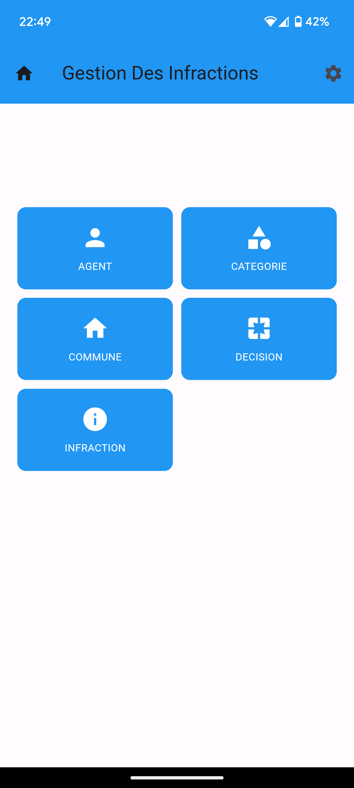
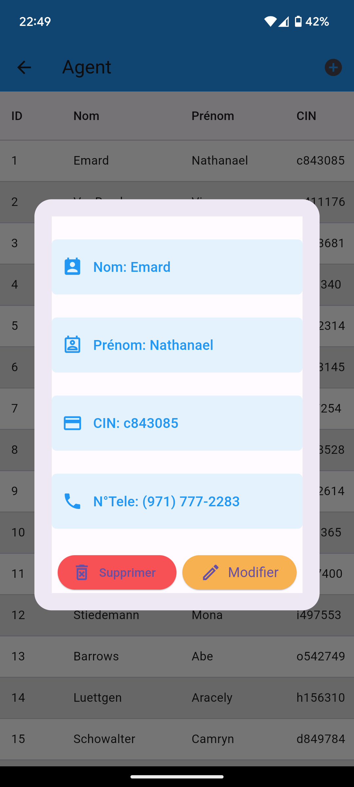

# 📱 gmsoft_infractions_mobile

[](https://github.com/yhafiane7/gmsoft-municipal-infractions-mobile/actions/workflows/ci.yml)
[](https://codecov.io/gh/yhafiane7/gmsoft-municipal-infractions-mobile)
[](https://flutter.dev/)
[](https://dart.dev/)

## 🌍 Overview

Feature‑modular Flutter client for municipal infractions management. Designed as part of a broader system: mobile data collection → Laravel REST API → relational database, with headroom for analytics pipelines and reporting.

---

## 🚀 Core features

- 📝 Structured data capture for infractions, agents, violators, and administrative zones
- 🌐 Asynchronous REST integration with deterministic error surfacing
- 🧩 Modular feature-based architecture and centralized routing/theme/messaging

---

## 🧠 Design patterns

- 🧱 MVC-ish: Models (DTOs), Controllers (ChangeNotifier), Views (feature widgets)
- 🗂️ Repository: `DataRepository` mediates CRUD per entity
- 🔌 Gateway: `ApiClient` encapsulates HTTP + error taxonomy
- 🎛️ Facade: `UiService` composes multi-entity flows for forms/dialogs
- 📦 Feature modularization: `lib/features/<entity>/{controllers,widgets}`
- 🧭 Coordinator: `routing.dart` binds routes and prefetches dependencies

---

## 🏗️ Architecture

- UI: Feature modules by domain; state via `ChangeNotifier`; named routes
- Service layer: `DataRepository` (CRUD orchestration) + `ApiClient` (HTTP, JSON, error taxonomy)
- Backend integration: Laravel API as business/persistence layer; ready for downstream analytics

High‑level flow

```
📱 Flutter app → 🌐 REST API (Laravel) → 🗄️ Database
                                       ↓
                               📊 Analytics / BI (future)
```

---

## 🔄 CI/CD

GitHub Actions pipeline for automated quality gates and build artifacts:

- ✅ Automated tests on every push/PR to `dev` (unit, widget, integration)
- 🔍 Static analysis and formatting (`flutter analyze`, `dart format`)
- 📦 Debug APK artifact for rapid QA
- 📈 Coverage reports (`coverage/lcov.info`), optional external upload
- ⚡ Cache-aware steps for faster runs

## 🧪 Testing

- 🧪 Unit (`test/models/**`, `test/services/**`, `test/unit/**`): business logic, repositories, API client
- 🧱 Widget (`test/features/**/widgets/**`, `test/widgets/**`): views, dialogs, routing
- 🔗 Integration (`test/integration/**`): end-to-end flows and API connectivity

Total test cases: **255+** across unit, widget, and integration suites.

## 🧰 Tech stack

- Flutter (Dart 2.19.x) for mobile UI
- HTTP (`http`) for REST communication
- State: `ChangeNotifier` + `ScaffoldMessenger` for UX messaging
- Testing: unit, widget, integration suites + coverage

### Local

Run tests and analysis locally to mirror CI:
`flutter pub get && flutter test --coverage && flutter analyze && dart format --output=none --set-exit-if-changed .`

### Code Coverage

The CI pipeline generates test coverage reports. To view coverage locally:

```bash
# Generate coverage report
flutter test --coverage

# View coverage (requires lcov)
genhtml coverage/lcov.info -o coverage/html
open coverage/html/index.html
```

**Note**: Codecov integration is optional. If you want to upload coverage reports to Codecov, add a `CODECOV_TOKEN` secret to your GitHub repository settings.

## ⚡ Setup & Run

1. **Prerequisites:**

   - Flutter SDK installed with Dart version **>=2.19.6 <3.0.0** (e.g., Flutter 3.10.6 or 3.13.x)
   - Backend API (Laravel app) must be running and reachable
   - A physical device or emulator to run the Flutter application

2. **Clone the repository:**

   ```bash
   git clone https://github.com/yhafiane7/gmsoft-municipal-infractions-mobile.git
   cd gmsoft-municipal-infractions-mobile
   ```

3. **Install dependencies:**

   ```bash
   flutter pub get
   ```

4. **Run the app:**

   ```bash
   flutter run
   ```

---

## 🖼️ Screens (select)

<p float="left">
  
  
</p>

---

## 🗺️ Roadmap

- Role-based authentication & authorization
- Real-time location and map visualization
- Offline-first data capture and sync
- Analytics and reporting integration
- Enhanced observability (logging, tracing)

---

## 🤝 Contribution

Contributions and suggestions are welcome. Please create issues or pull requests for improvements.

---

## 📬 Contact

For questions or support, contact me on my email hafianeyassine8@gmail.com .
